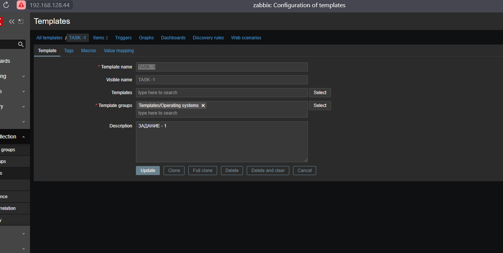
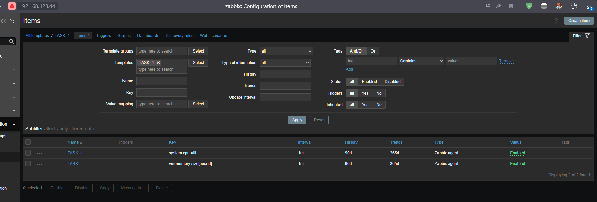
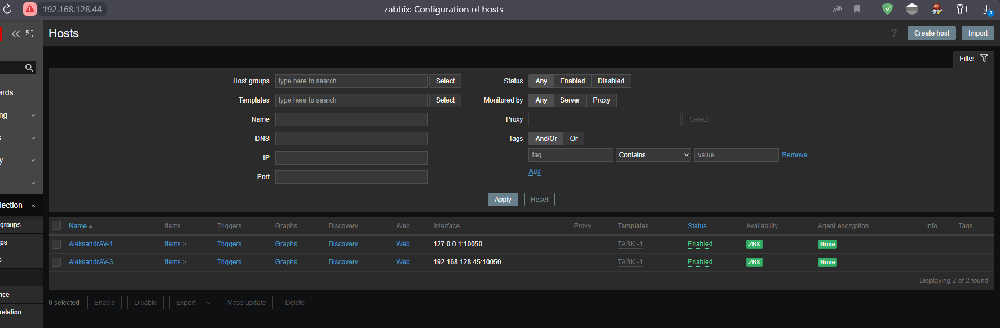
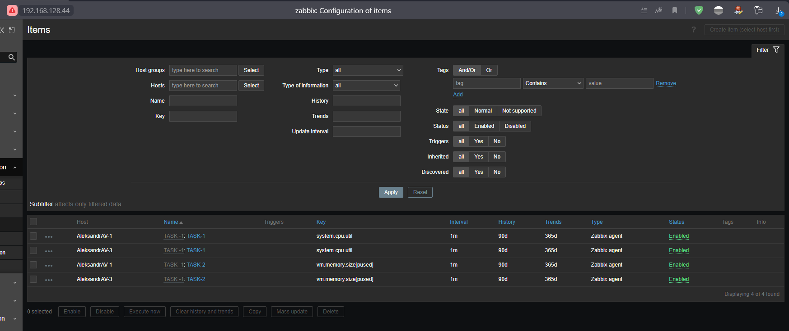

# hw-02-2_zabbix

# Домашнее задание к занятию «Система мониторинга Zabbix. Часть 2»
## Андреев Александр Вадимович

# Задание 1
## Создайте свой шаблон, в котором будут элементы данных, мониторящие загрузку CPU и RAM хоста.
### Прикрепите в файл README.md скриншот страницы шаблона с названием «Задание 1»

# Задание 2 and Задание 3
## Добавьте в Zabbix два хоста и задайте им имена <фамилия и инициалы-1> и <фамилия и инициалы-2>. Например: ivanovii-1 и ivanovii-2.
## Привяжите созданный шаблон к двум хостам. Также привяжите к обоим хостам шаблон Linux by Zabbix Agent.	 

# Задание 4
## Создайте свой кастомный дашборд.

